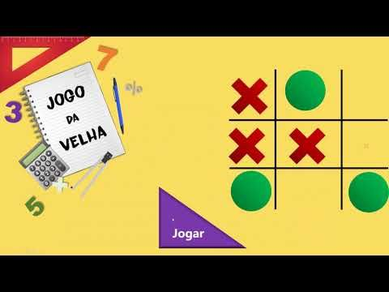

<h1 align="center">Jogo da Velha:</h5>

  

# jogo_da_velha
Criando o próprio jogo da velha

##  Tarefas
  O controle das tarefas desse projeto será realizado abaixo.

  *  Estrutura inicial
  *  Estilização do jogo
  *  Ações do Jogo
  *  Finalização do projeto.

##  Ícones
-  📦 Nova funcionalidade
-  🔄 Atualização
-  🐛 Correção de bug
-  🏁 Lançamento

   
  
  Desenvolvido em HTML, CSS e JS.

- Desafio prático realizado na plataforma [Digital Innovation One](https://web.digitalinnovation.one/home "Digital Innovation One"): [Criando seu próprio jogo da velha com HTML e Javascript](https://web.digitalinnovation.one/project/criando-seu-proprio-jogo-da-velha-com-html-e-javascript/learning/77459b5a-ef9a-4b9f-8806-e76e00a84a97?back=/track/javascript-game-developer&bootcamp_id=598f2ee3-6af1-4370-a843-2cb9afe2f70f").
